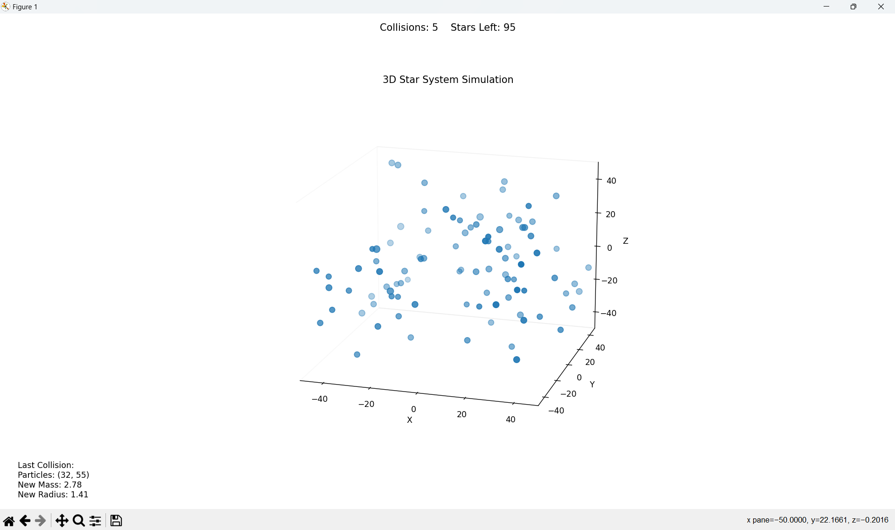

# 3D Star Collision Simulation

This Python project simulates a system of stars in 3D space, illustrating gravitational interactions and collisions. Stars move under gravitational forces, and when they collide, they merge into larger stars while conserving mass and momentum.

 <!-- Replace with an actual screenshot path -->

## Features

- **Realistic Physics**: Gravitational interactions between stars.
- **Star Collisions**: Stars merge on collision, conserving mass and momentum.
- **Visualization**: 3D visualization using Matplotlib.
- **Collision Logging**: Details of collisions are saved to a log file (`collision_log.txt`).
- **Dynamic Annotations**: Collision count, remaining stars, and last collision details displayed during the simulation.

---

## Table of Contents

1. [Requirements](#requirements)
2. [Installation](#installation)


## Requirements

- Python 3.8 or higher
- Libraries:
  - `numpy`
  - `matplotlib`

To install the required libraries, use the included `requirements.txt` file.

## Installation
### Clone this repository:
```bash
git clone https://github.com/your-username/star-collider.git
cd star-simulation
```
### Install dependencies:
```bash
pip install -r requirements.txt
```
### Run the script:
```bash
python main.py
```
Enjoy!

